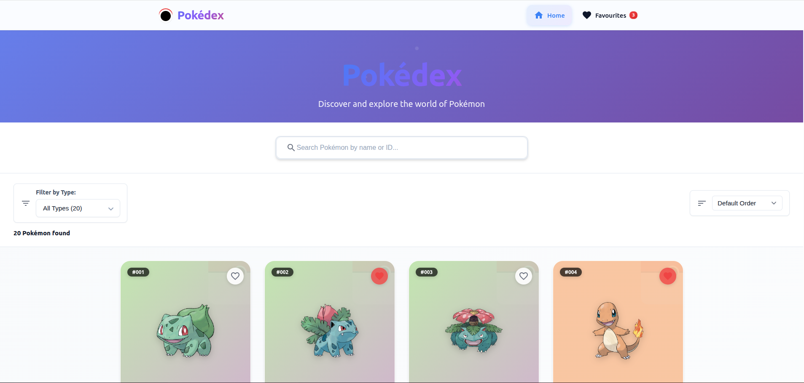
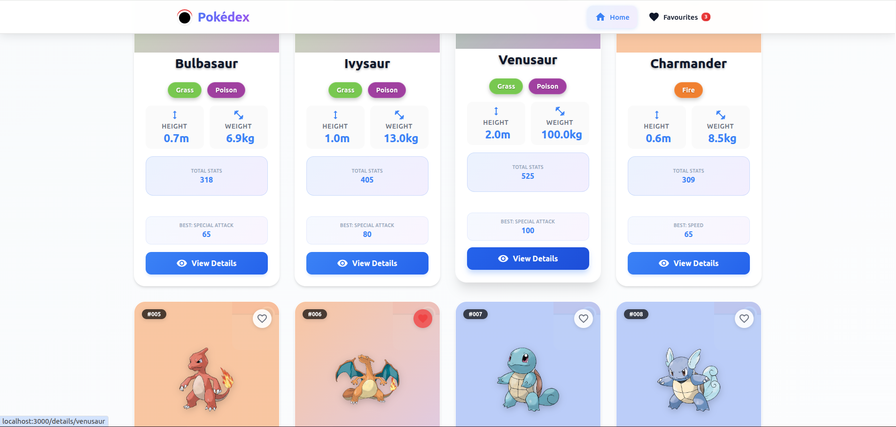

# 🎮 Pokédex App

A modern, responsive Pokédex web application built with React that allows users to explore, search, and favorite their beloved Pokémon. This app provides detailed information about Pokémon with a beautiful, intuitive interface.




## ✨ Features

- **Browse Pokémon**: Infinite scroll through all available Pokémon
- **Real-time Search**: Find Pokémon instantly by name or ID
- **Detailed Information**: Comprehensive stats, abilities, moves, and evolution chains
- **Favorites System**: Save and manage your favorite Pokémon
- **Responsive Design**: Works seamlessly on desktop, tablet, and mobile devices
- **Type-based Theming**: Dynamic color schemes based on Pokémon types

## 🛠️ Tech Stack

- **React** - Frontend framework with hooks
- **React Router** - Client-side routing
- **CSS3** - Modern styling with Grid & Flexbox
- **Material-UI Icons** - Icon components
- **PokéAPI** - Pokémon data source
- **Context API** - State management for favorites

## 📱 App Structure

### **Home Page**
The main landing page features a responsive grid of Pokémon cards. Users can:
- Browse through all Pokémon with infinite scroll loading
- Search for specific Pokémon using the search bar
- Click on any Pokémon card to view detailed information
- Add/remove Pokémon from favorites using the heart icon

### **Pokémon Details Page**
A comprehensive view of individual Pokémon including:

**Hero Section**
- Large Pokémon artwork with type-based gradient background
- Pokémon name, ID number, and type badges
- Navigation controls (back button, favorite toggle)

**Quick Stats Cards**
- Height and weight information
- Base experience points
- Clean card-based layout with icons

**Tabbed Content System**
- **Stats Tab**: Base stats with visual progress bars and color coding
- **Moves Tab**: Complete move list with "Show More" functionality for Pokémon with 20+ moves
- **Evolution Tab**: Visual evolution chain with clickable navigation between forms

### **Favorites Page**
Dedicated page for managing favorite Pokémon:
- Grid layout of favorited Pokémon
- Persistent storage using localStorage
- Easy removal of favorites
- Empty state when no favorites are saved

### **Header Navigation**
Consistent navigation bar across all pages:
- App logo/branding
- Navigation links (Home, Favorites)
- Clean, minimal design

## 🎨 Design Highlights

**Visual Theme**
- Modern, clean interface with subtle shadows and gradients
- Dynamic color theming based on Pokémon types (Fire = red/orange, Water = blue, etc.)
- Glassmorphism effects with backdrop blur on certain elements

**User Experience**
- Smooth hover animations and transitions
- Loading states with custom Pokéball spinner
- Error handling with user-friendly messages
- Touch-friendly mobile interface

**Responsive Design**
- Mobile-first approach with progressive enhancement
- Flexible grid layouts that adapt to screen size
- Optimized typography scaling across devices

## 🚀 Getting Started

### Prerequisites
- Node.js (v14 or higher)
- npm or yarn

### Installation

1. Clone the repository
```bash
git clone <repository-url>
cd pokedex-app
```

2. Install dependencies
```bash
npm install
```

3. Start the development server
```bash
npm start
```

4. Open http://localhost:3000 in your browser

## 📂 Project Structure

```
src/
├── components/           # Reusable UI components
│   ├── Header/          # Navigation header
│   └── PokemonCard/     # Individual Pokémon cards
├── pages/               # Main page components
│   ├── Home/           # Home page with Pokémon grid
│   ├── Details/        # Detailed Pokémon view
│   └── Favourites/     # Favorites management
├── context/            # React Context for state management
├── services/           # API service functions
└── utils/              # Helper utilities
```

## 🔧 Key Implementation Details

**State Management**: Uses React Context API for managing favorites across the application, with localStorage persistence.

**API Integration**: Integrates with PokéAPI to fetch Pokémon data, evolution chains, and detailed information.

**Performance**: Implements infinite scroll for smooth browsing, image lazy loading, and memoized components for optimal performance.

**Accessibility**: Includes proper focus states, keyboard navigation, and semantic HTML structure.

## 🌟 Notable Features

- **Dynamic Theming**: Background gradients automatically adjust based on Pokémon types
- **Evolution Navigation**: Click through evolution chains seamlessly
- **Smart Move Display**: Initially shows 20 moves with option to expand
- **Persistent Favorites**: Favorites are saved locally and persist between sessions
- **Error Recovery**: Graceful fallbacks for failed API calls or missing images

---

*Built with ❤️ using React and PokéAPI*
